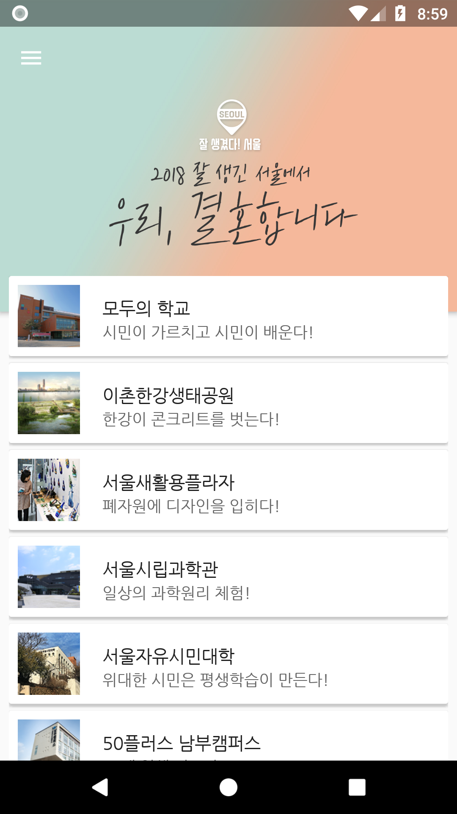

# seoul-2018

[서울특별시](http://seoul.go.kr/)에서 운영하는 [2018 잘 생겼다! 서울](https://www.2018seoul.com/) 사이트의 내용을 제공하는 애플리케이션입니다.

## Screenshots




## Android Studio IDE Setup

seoul-2018 uses [ktlint](https://github.com/shyiko/ktlint) to enforce Kotlin coding styles.

- Close Android Studio if it's open

- Download ktlint to root directory:

```
curl -sSLO https://github.com/shyiko/ktlint/releases/download/0.24.0/ktlint
```

- Run this commands:

> Windows
```
java -jar ktlint --apply-to-idea-project --android
```

> Linux
```
chmod a+x ktlint && ktlint --apply-to-idea-project --android
```